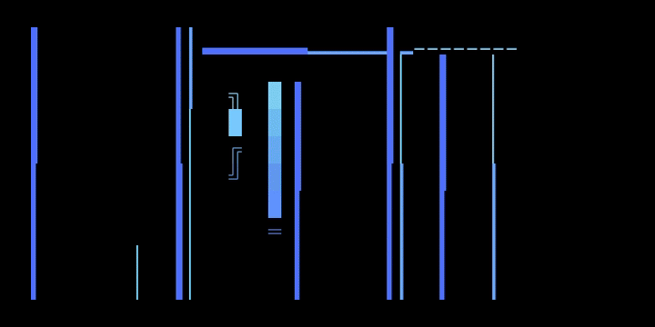
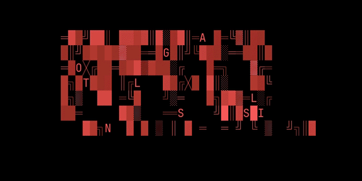
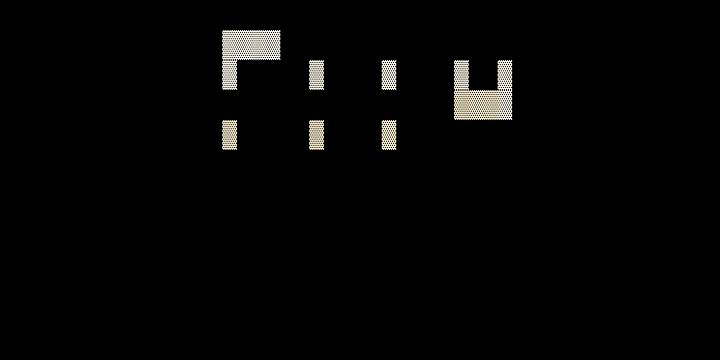
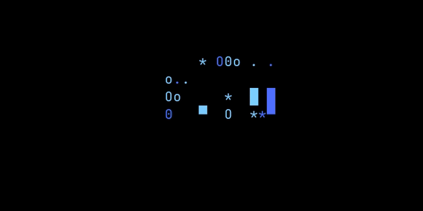
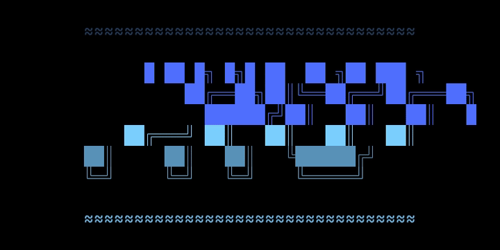

# PITO Screensavers

Seventeen distinct **PITO-logo terminal screensavers** for [Omarchy](https://omarchy.org),
animated by [TerminalTextEffects](https://github.com/ChrisBuilds/terminaltexteffects)
(`tte`). Each variant is its own ASCII art + its own effect + its own pinned
color — single or adjacent hues, **no rainbow**.

They replace Omarchy's default screensaver via a one-line `hypridle` hook and
**survive `omarchy update`** — nothing inside `~/.local/share/omarchy` is touched.

## Gallery

A few favorites (recorded at 12 fps; run `bin/gallery` to see all 17 live):

<table>
  <tr>
    <td align="center" width="50%"><br><b>Ice Beams</b> · <code>beams</code></td>
    <td align="center" width="50%"><br><b>Glitch</b> · <code>unstable</code></td>
  </tr>
  <tr>
    <td align="center"><br><b>Pixel Pour</b> · <code>pour</code></td>
    <td align="center"><br><b>Synthwave Grid</b> · <code>synthgrid</code></td>
  </tr>
  <tr>
    <td align="center"><br><b>Bouncy Logo</b> · <code>bouncyballs</code></td>
    <td align="center"><br><b>VHS Tracking</b> · <code>vhstape</code></td>
  </tr>
</table>

## Preview first (changes nothing)

```bash
git clone git@github.com:gmrdad82/screensavers.git ~/Dev/screensavers
cd ~/Dev/screensavers

./bin/gallery            # cycle all 17 in this terminal (Ctrl-C to stop)
./bin/preview 6          # render just one (0–16)
GALLERY_SECONDS=4 ./bin/gallery
```

Requires `tte` (`pipx install terminaltexteffects` or your distro package) and,
for the real screensaver, Omarchy/Hyprland (`hyprctl`, `jq`).

## Install / uninstall

```bash
./install.sh             # hook idle (hypridle) + menu/keybinds (PATH shim)
./uninstall.sh           # restore the Omarchy default
./bin/check              # sanity check (scripts + variants)
```

`install.sh` wires up **both** ways Omarchy starts a screensaver, touching only
your user config (nothing inside `~/.local/share/omarchy`, so `omarchy update` is
never affected):

- **Idle** — rewrites the `on-timeout` line in `~/.config/hypr/hypridle.conf`
  (backs it up to `.bak`). Effective immediately.
- **Omarchy menu + keybinds** — these call the bare `omarchy-launch-screensaver`,
  so `install.sh` prepends a one-symlink shim dir (`shim/`) to the session `PATH`
  in `~/.config/uwsm/env`, shadowing just that command. **Takes effect after you
  log out and back in** (PATH changes need a fresh session).

Test the full screensaver right now (exactly what the menu runs):
`./bin/launch force`. If a future Omarchy update rewrites those config files,
re-run `./install.sh`.

## All 17 variants

▶ = shown animated in the [Gallery](#gallery) above.

| # | Variant | Effect | Palette | |
|---|---|---|---|:-:|
| 0 | Ice Beams | beams | blue → ice | ▶ |
| 1 | Decrypt | decrypt | blue | |
| 2 | 3D Extrude | slide | amber | |
| 3 | VHS Tracking | vhstape | steel cyan | ▶ |
| 4 | Icon Bloom | expand | emerald | |
| 5 | Black Hole P | blackhole | violet | |
| 6 | Outline Rain | rain | mono white | |
| 7 | Tagline Swarm | swarm | blue → ice | |
| 8 | Pixel Pour | pour | gold | ▶ |
| 9 | Glitch | unstable | crimson | ▶ |
| 10 | Circuit Board | binarypath | emerald | |
| 11 | Starfield Warp | scattered | ice → blue | |
| 12 | Wave Pool | waves | blue → indigo | |
| 13 | Fireworks | fireworks | gold → amber | |
| 14 | Bouncy Logo | bouncyballs | steel → blue | ▶ |
| 15 | Synthwave Grid | synthgrid | violet | ▶ |
| 16 | Spotlight Reveal | spotlights | white → cyan | |

(`bin/preview` indices are 0-based and match `variants.conf` order.)

## Add your own

Drop `art/NN-name.txt`, add a line to `variants.conf`
(`art|effect|extra_tte_args|label`), pin a tasteful gradient, run `./bin/check`.
See [CLAUDE.md](CLAUDE.md) for conventions.

The gallery GIFs are generated with `bin/record-gifs` (needs `vhs`); edit the
`HEROES` list in that script to change which variants get a preview.

## License

[AGPL-3.0](LICENSE). Free for personal use. If you modify, redistribute, or
commercialize it, **credit gmrdad82** (https://github.com/gmrdad82) — see
[NOTICE](NOTICE). The PITO mark comes from [PITO](https://github.com/gmrdad82/pito).
